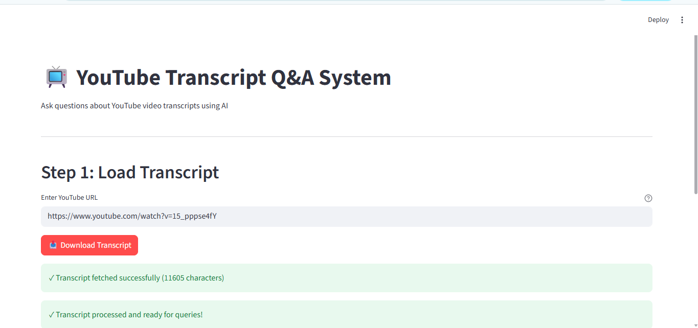
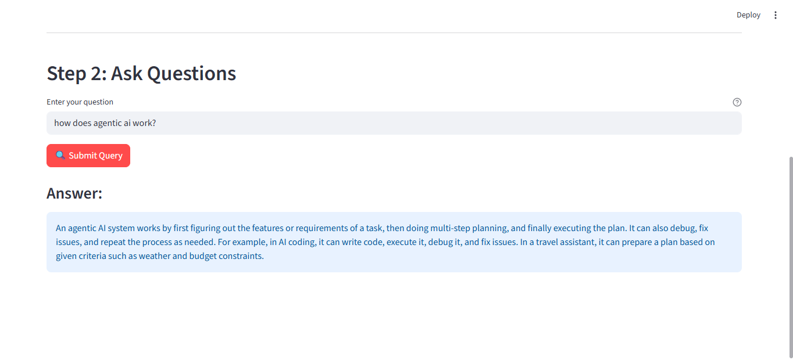

# YouTube Transcript Q&A System

A powerful application that allows you to ask questions about YouTube video transcripts using AI-powered Retrieval-Augmented Generation (RAG). The system extracts transcripts from YouTube videos, processes them using embeddings, and enables semantic search to answer questions based on the video content.



## Features

- 📺 **YouTube Transcript Extraction**: Automatically fetches transcripts from YouTube videos
- 🔍 **Semantic Search**: Uses embeddings and vector similarity search to find relevant content
- 🤖 **AI-Powered Q&A**: Leverages Groq's LLM to generate factual answers based on video context
- 💾 **Vector Database**: Stores transcript chunks in ChromaDB for efficient retrieval
- 🎨 **Streamlit UI**: User-friendly web interface for easy interaction
- ✅ **Context-Aware Answers**: Only answers based on video content, responds "I don't know" for out-of-context questions

## Installation

### Prerequisites

- Python 3.8 or higher
- Groq API key (get one from [Groq Console](https://console.groq.com/))

### Setup

1. Clone the repository:
```bash
git clone <repository-url>
cd youtube_summariser
```

2. Install dependencies:
```bash
pip install -r requirements.txt
```

3. Create a `.env` file in the root directory:
```bash
GROQ_API_KEY=your_groq_api_key_here
```

## Usage

### Streamlit Web Interface (Recommended)



Run the Streamlit app:
```bash
streamlit run streamlit_app.py
```

The app will open in your browser. Follow these steps:

1. **Load Transcript**: 
   - Enter a YouTube video URL
   - Click "Download Transcript"
   - Wait for processing to complete

2. **Ask Questions**:
   - Enter your question in the query input
   - Click "Submit Query"
   - View the AI-generated answer

### Command Line Usage

You can also use the functions directly in Python:

```python
from app import (
    get_youtube_transcript,
    chunk_transcript,
    store_in_chromadb,
    create_retriever,
    initialize_groq,
    answer_query
)

# Fetch transcript
video_url = "https://www.youtube.com/watch?v=YOUR_VIDEO_ID"
transcript = get_youtube_transcript(video_url)

# Process and store
documents = chunk_transcript(transcript)
vectorstore = store_in_chromadb(documents)
retriever = create_retriever(vectorstore, k=4)
llm = initialize_groq()

# Query
answer = answer_query("What is the main topic?", retriever, llm)
print(answer)
```

### Testing

Run the test functions:
```bash
python app.py
```

This will run `test_rag_system()` which demonstrates the complete RAG workflow.

## Project Structure

```
youtube_summariser/
├── app.py                 # Core functions for transcript processing and RAG
├── streamlit_app.py       # Streamlit web interface
├── requirements.txt       # Python dependencies
├── README.md             # This file
├── .env                  # Environment variables (create this)
├── images/               # Screenshots and images
│   ├── image1.png
│   └── image2.png
└── chroma_db/            # ChromaDB vector database (created automatically)
```

## How It Works

1. **Transcript Extraction**: Fetches English transcripts from YouTube videos using the YouTube Transcript API
2. **Text Chunking**: Splits the transcript into smaller chunks for efficient processing
3. **Embedding Generation**: Creates embeddings using HuggingFace's sentence-transformers model
4. **Vector Storage**: Stores embeddings in ChromaDB for fast similarity search
5. **Query Processing**: 
   - Converts user query to embeddings
   - Performs similarity search to find relevant chunks
   - Augments the prompt with retrieved context
6. **Answer Generation**: Uses Groq's LLM to generate factual answers based on the context

## Technologies Used

- **LangChain**: Framework for building LLM applications
- **Groq**: High-performance LLM inference
- **ChromaDB**: Vector database for embeddings
- **HuggingFace Embeddings**: Sentence transformers for semantic search
- **Streamlit**: Web interface framework
- **YouTube Transcript API**: Transcript extraction

## Configuration

### Environment Variables

- `GROQ_API_KEY`: Your Groq API key (required)

### Adjustable Parameters

In `app.py`, you can modify:
- `chunk_size`: Size of text chunks (default: 1000)
- `chunk_overlap`: Overlap between chunks (default: 200)
- `k`: Number of retrieved documents (default: 4)
- `temperature`: LLM temperature (default: 0.7)

## Limitations

- Only works with videos that have English transcripts available
- Requires internet connection for transcript fetching
- Processing time depends on video length
- Answers are limited to information present in the video transcript

## Troubleshooting

### Common Issues

1. **"GROQ_API_KEY environment variable is not set"**
   - Make sure you've created a `.env` file with your API key

2. **"Transcripts are disabled for video"**
   - The video doesn't have transcripts enabled. Try a different video.

3. **"No transcript found"**
   - The video may not have English transcripts. Check if transcripts are available.

4. **Import errors**
   - Make sure all dependencies are installed: `pip install -r requirements.txt`

## License

This project is open source and available for personal and educational use.

## Contributing

Contributions are welcome! Please feel free to submit a Pull Request.